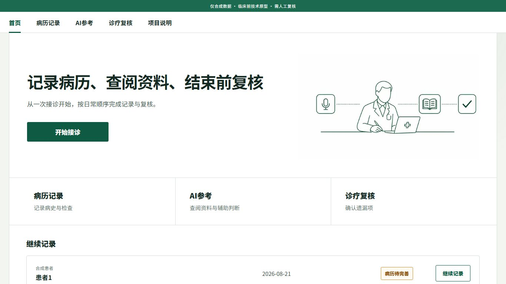
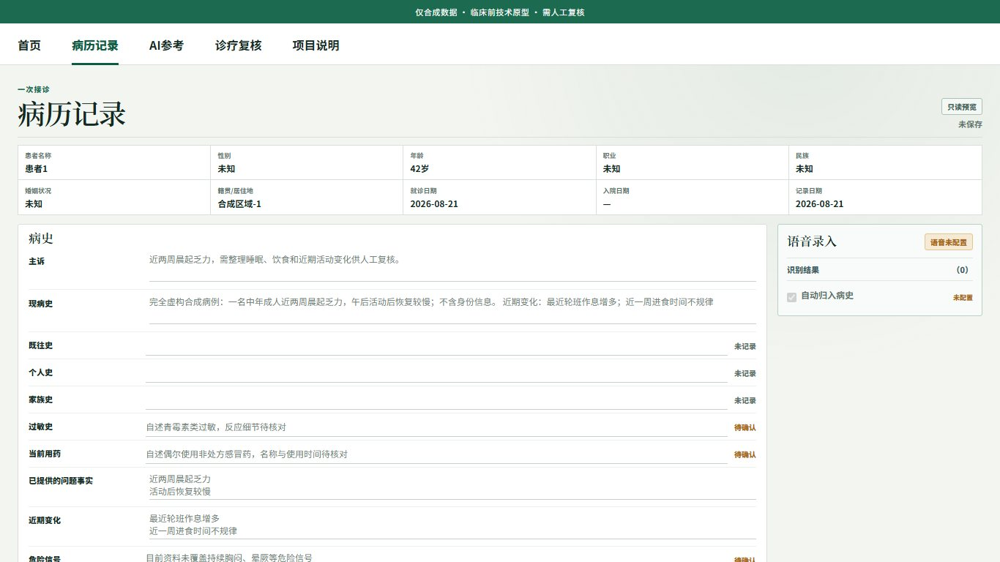
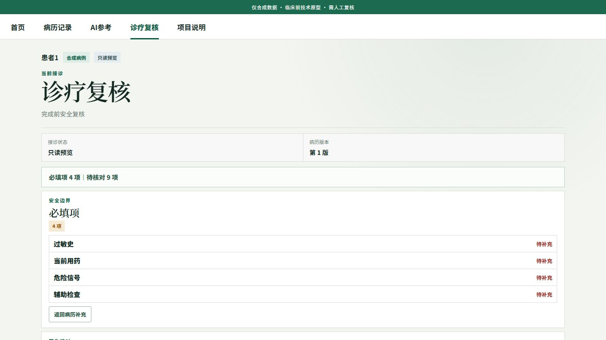

# 中文门诊病例演示网页

这是作者为“四新”比赛制作的网页案例。项目使用虚构病例和合成资料，演示门诊记录从建立、填写、查阅参考资料到最终确认的大致过程。

这个项目只用于比赛展示、学习和研究，不能用于真实诊疗，也不能代替医生判断。

## 页面快照

<table>
  <tr>
    <th>首页</th>
    <th>病历记录</th>
  </tr>
  <tr>
    <td></td>
    <td></td>
  </tr>
  <tr>
    <th>AI参考</th>
    <th>诊疗复核</th>
  </tr>
  <tr>
    <td></td>
    <td></td>
  </tr>
</table>

## 最简单的启动方式（Windows）

在 [GitHub Releases](https://github.com/Joe-cyz/bounded-clinical-adaptation-competition-demo/releases/latest) 下载其中一个压缩包：

- `bounded-clinical-adaptation-windows-portable.zip`：体积较小，不启用麦克风；
- `bounded-clinical-adaptation-windows-voice-portable.zip`：包含离线中文语音组件，可以录音转写，文件较大。

使用方法相同：

1. 解压整个压缩包；
2. 双击 `start-demo.cmd`；
3. 等待浏览器自动打开。

两种便携版都包含运行环境，不需要安装 Node.js、pnpm 或其他依赖。新版使用精简的运行文件，解压项目数比旧版少很多。

## 离线语音

语音版只在点击“开始录音”后请求麦克风。单次最长15秒，到时会自动识别；也可以提前点击“结束并识别”。转写在本机完成，不会上传到云端，录音在停止、取消或失败后删除。

识别文字先作为待处理建议显示。你可以修改文字和归入栏目，再选择“写入”或“忽略”；它不会自动改变病历。处理完后可以继续录下一段。

语音功能仍用于原型演示，请只朗读虚构内容。浏览器建议使用最新版 Edge 或 Chrome。

## 从源代码启动

### Windows

1. 电脑需要先安装 [Node.js 24](https://nodejs.org/en/download)。
2. 下载并解压项目。
3. 双击根目录里的 `start-demo.cmd`。

第一次启动会自动安装网页所需的依赖，完成后浏览器会打开演示页面。以后再次启动只需双击同一个文件。停止运行时，关闭启动窗口或按 `Ctrl+C`。

### macOS / Linux

在项目目录运行：

```bash
chmod +x start-demo.sh
./start-demo.sh
```

## 网页内容

- 预置的虚构门诊病例；
- 病历填写与版本记录；
- 参考信息和资料检索页面；
- 诊疗内容复核与最终确认页面；
- 只使用本地合成数据的演示环境；
- 可选的本地离线语音转写。

一键启动不会连接真实模型服务。轻量版不会启用麦克风；语音版只在你主动点击后录音。演示过程中请只填写和朗读虚构内容，不要输入真实患者信息。

## 开发者运行

```bash
pnpm install --frozen-lockfile
pnpm dev
```

浏览器访问 `http://localhost:3000`。测试命令为：

```bash
pnpm typecheck
pnpm lint
pnpm test
pnpm build
```

需要自行制作便携包时，运行 `pnpm portable:windows`。语音版还需要把经过校验的 whisper.cpp v1.9.2 Windows 运行目录和 `ggml-small.bin` 路径传给打包脚本；二者不会提交到源码仓库。

更多说明见 [当前功能](docs/current-status.md)、[操作指南](docs/beginner-operation-guide.md) 和 [项目结构](docs/architecture.md)。

## 开源许可

本项目使用 [MIT License](LICENSE)。所有病例和演示资料均为合成内容。
